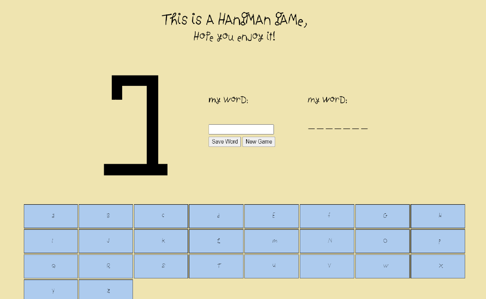

# Hangman

##This is my [Hangman](https://alexjs6.github.io/Hangman/) game.

This was an optional task in the JS Chapter.
You can find the instructions here: https://github.com/becodeorg/BXL-Swartz-3-21/blob/master/05-Javascript/hangman.adoc

It was done alone during the week-end.
Languages used:
* JS
* HTML
* CSS

The code is a long code but copy pasted from the first letter (A).
The letter A algorithm:

```js
document.getElementsByClassName("myTd")[0].addEventListener("click", () => {
        for (let i=0; i<myInputLength; i++) {
            if (myWord[i] === "a") {
                myNotHidden.splice(i, 1, "a");
                console.log(myTruth);
                document.getElementById("theWord").innerHTML = myNotHidden.join(" ");
                document.getElementsByClassName("myTd")[0].style.backgroundColor = "#bfb";
                my_a ="a"
                if (myNotHidden.join("") === myInput) {
                    document.body.style.backgroundColor = "rgb(100, 250, 100)";
                    alert("You Won! Refresh Page to play again!");
                    document.getElementsByClassName("myImg")[0].src = "static/images.png/HangmanWin.png";
                }
            }
            else {
                if (my_a != "a") {
                    my_a = "aa";
                }   
            }
        }
        if (my_a == "aa") {
            document.getElementsByClassName("myTd")[0].style.backgroundColor = "#fbb";
            myImage += 1;
            console.log(myImage);
        }
        if (myImage == 1) {
            document.getElementsByClassName("myImg")[0].src = "static/images.png/Hangman1.png";
        }
        else if (myImage == 2) {
            document.getElementsByClassName("myImg")[0].src = "static/images.png/Hangman2.png";
        }
        else if (myImage == 3) {
            document.getElementsByClassName("myImg")[0].src = "static/images.png/Hangman3.png";
        }
        else if (myImage == 4) {
            document.getElementsByClassName("myImg")[0].src = "static/images.png/Hangman4.png";
        }
        else if (myImage == 5) {
            document.getElementsByClassName("myImg")[0].src = "static/images.png/Hangman5.png";
        }
        else if (myImage == 6) {
            document.getElementsByClassName("myImg")[0].src = "static/images.png/Hangman6.png";
        }
        else if (myImage == 7) {
            document.getElementsByClassName("myImg")[0].src = "static/images.png/Hangman7.png";
            document.body.style.backgroundColor = "rgb(250, 100, 100)";
            alert("You Lost! Refresh Page to try again!");
        }
    })
```

Done after 1 month and a half into Becode.
    
It is mostly finished but still working on some things.



Enjoy!
